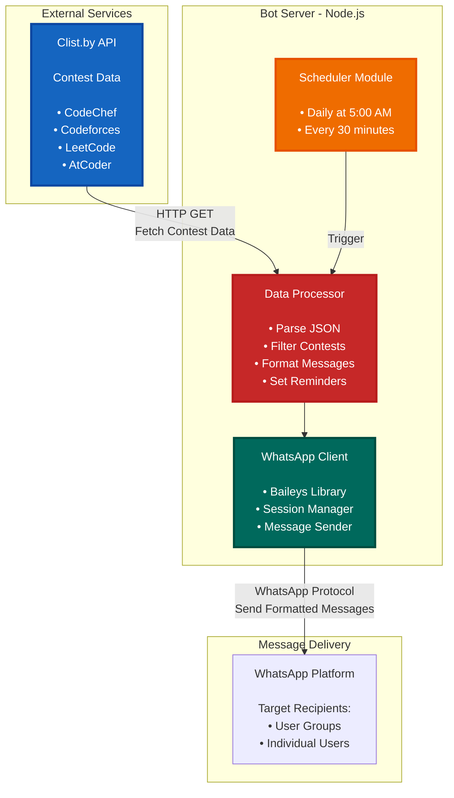
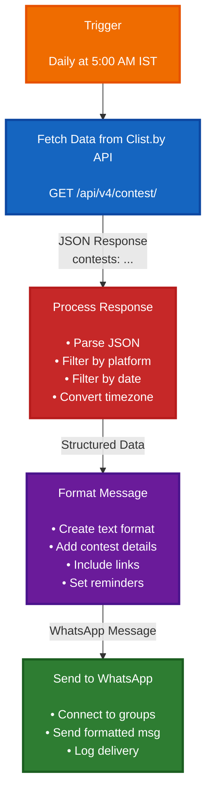
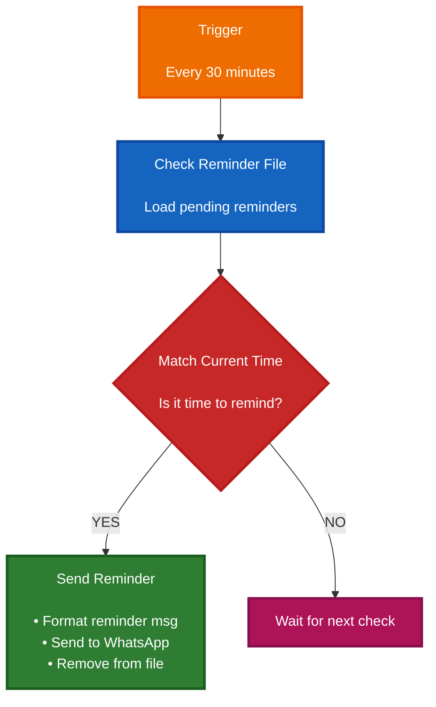
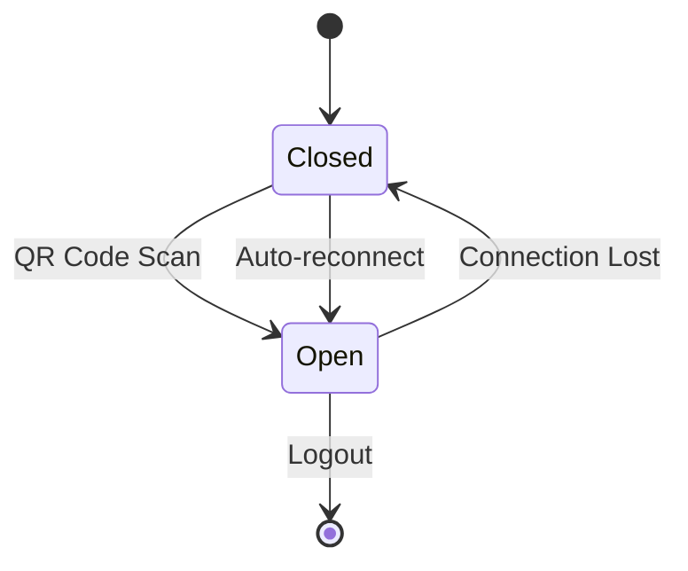

# System Architecture

## High-Level Design

The Contest-Reminder-WhatsApp-Bot follows a simple, efficient architecture with three main components: the Bot Server, external data sources, and WhatsApp as the delivery platform.



## Data Flow

### 1. Contest Notification Flow



### 2. Reminder Flow



## Component Details

### 1. Scheduler Module

Manages all automated tasks and timing:

- **Daily Contest Notifications**: Runs at 5:00 AM IST
- **Reminder Checks**: Every 30 minutes

### 2. Data Processor

Handles all contest data operations:

- Fetches data from Clist.by API
- Filters contests by platform (CodeChef, Codeforces, LeetCode, AtCoder)
- Filters contests by date (today and tomorrow)
- Converts timezones (UTC to IST)
- Formats messages for WhatsApp
- Creates and stores reminders

### 3. WhatsApp Client

Manages all WhatsApp communication:

- Uses Baileys library for WhatsApp Web API
- Handles QR code authentication
- Maintains persistent sessions
- Sends messages to groups and individuals
- Auto-reconnection logic

### 4. WhatsApp Integration Layer

#### Connection Management



**Disconnect Handling**:
- `loggedOut`: Requires re-authentication
- `connectionClosed`: Auto-reconnect
- `connectionLost`: Auto-reconnect
- `connectionReplaced`: Manual restart required
- `restartRequired`: Auto-restart
- `timedOut`: Auto-reconnect

#### Authentication
- Uses Baileys multi-file auth state
- Stores credentials in `auth_info_baileys/`
- QR code generated on first run
- Persistent session across restarts

### 5. Storage Layer

#### File-Based Storage

**auth_info_baileys/**
- Session credentials
- Pre-keys for encryption
- Device information
- App state sync data

**reminderFile.txt**
```json
{
  "time": "2024-01-15T10:30:00.000Z",
  "message": "Contest reminder message"
}
```

#### In-Memory Storage (NodeCache)

```javascript
groupCache = {
  stdTTL: 300,  // 5 minutes
  useClones: false
}
```
- Caches group metadata
- Reduces API calls
- Improves performance

